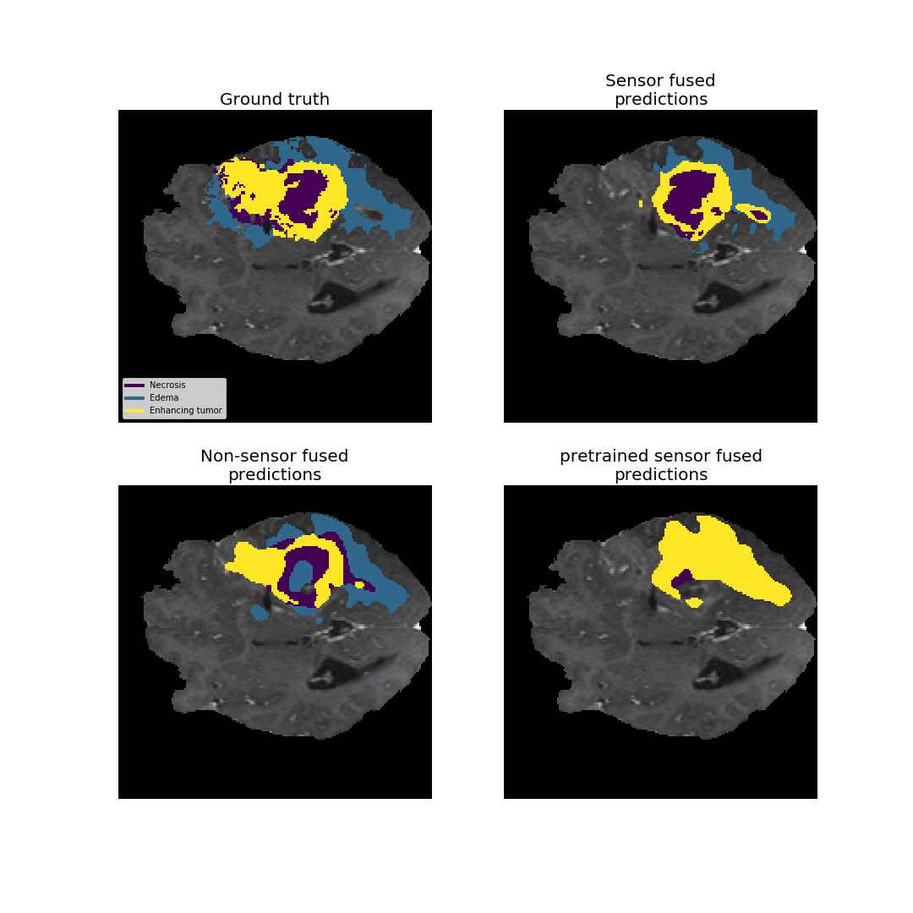
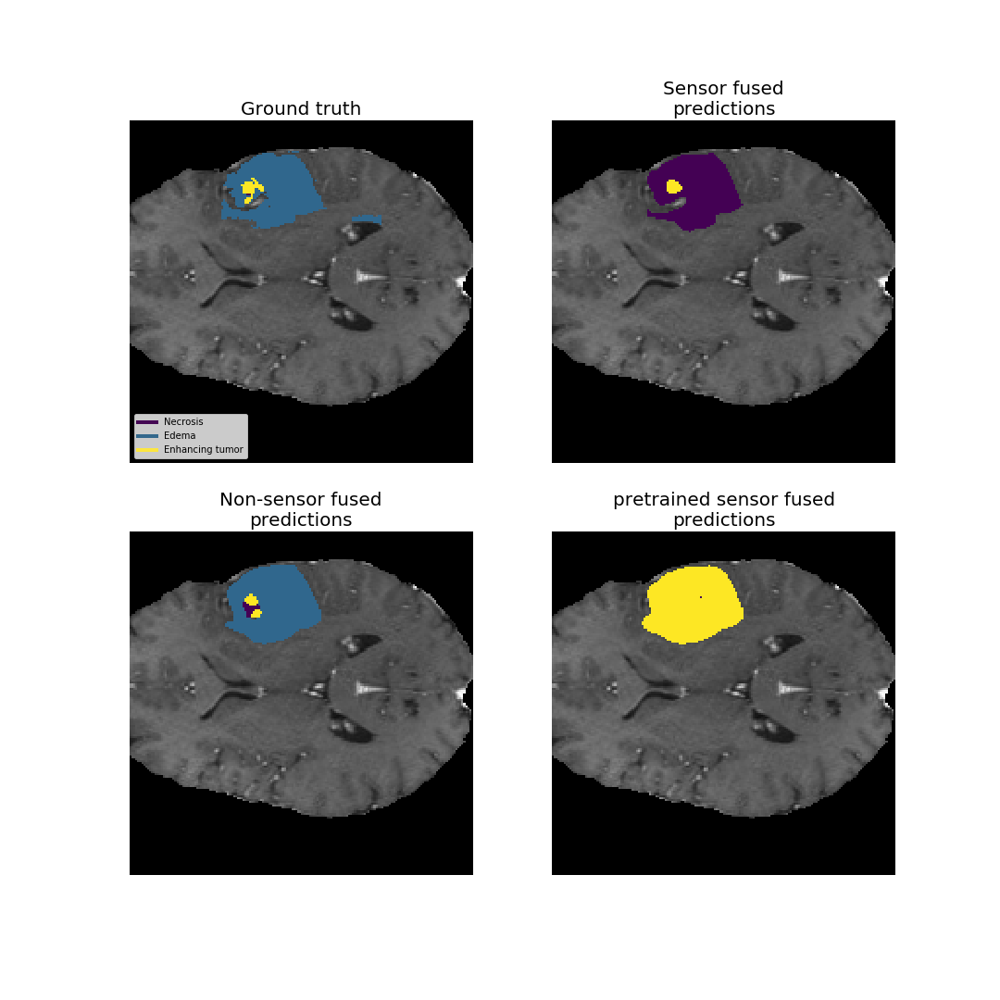
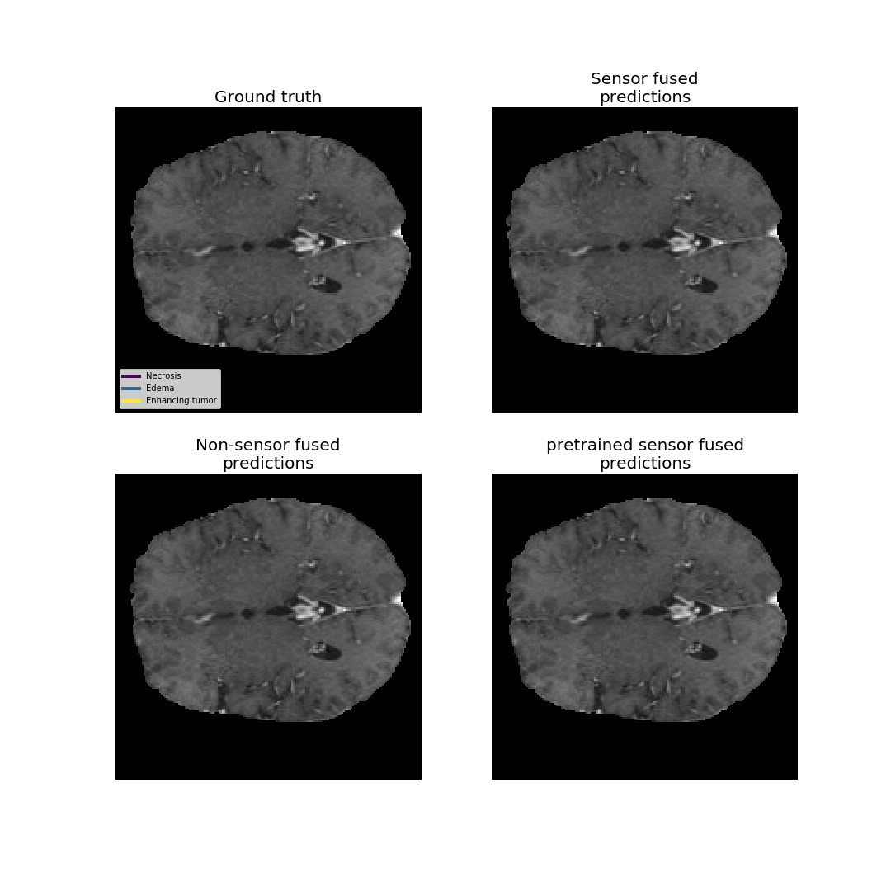

# Models with trained weights
The trained models can be found [here!](https://drive.google.com/open?id=1_bwPKMN2R7OXwfuVn8ThqN8VnUDTffEG)

# Scripts for training U-Nets for BraTS challenge
The scripts in the root folder of the repo is labeled according to the thesis and can be used to train models using the BraTS-data.

# Data setup
The data setup is that one should have the MICCAI BraTS-dataset
converted into numpy in the repo for the scripts to work.

# Results
Here follows a few examples of the results of the different networks
that were implemented

